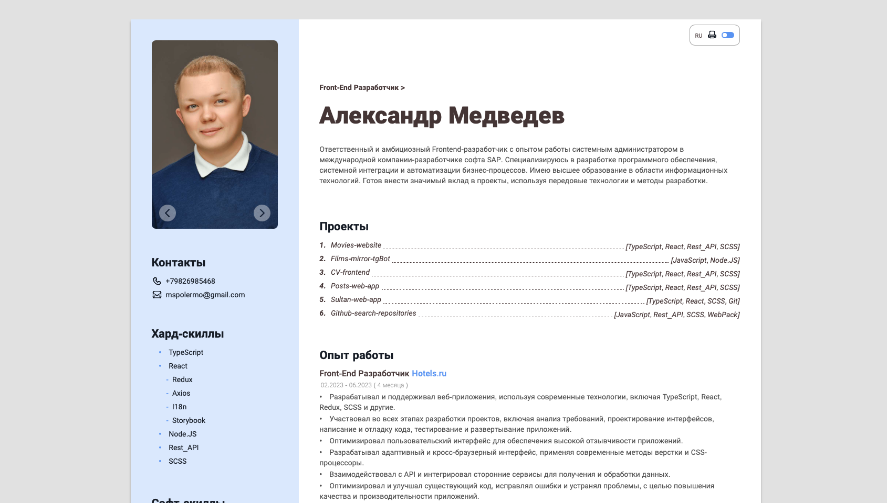
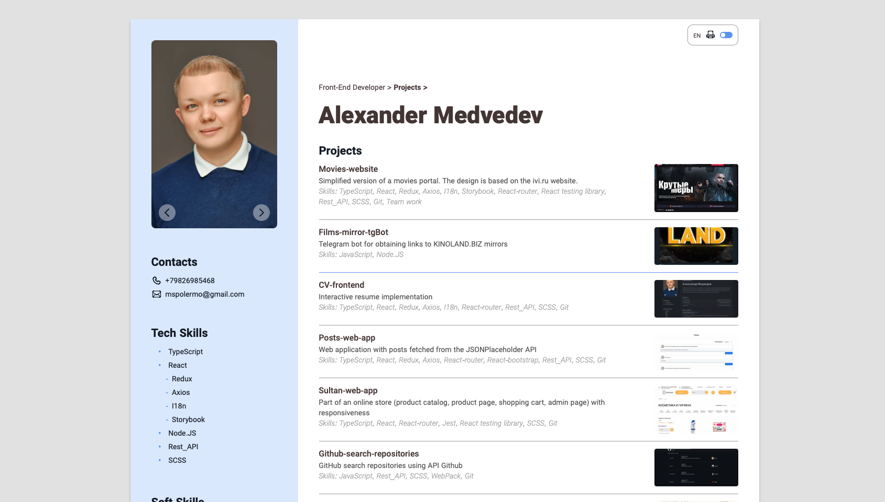
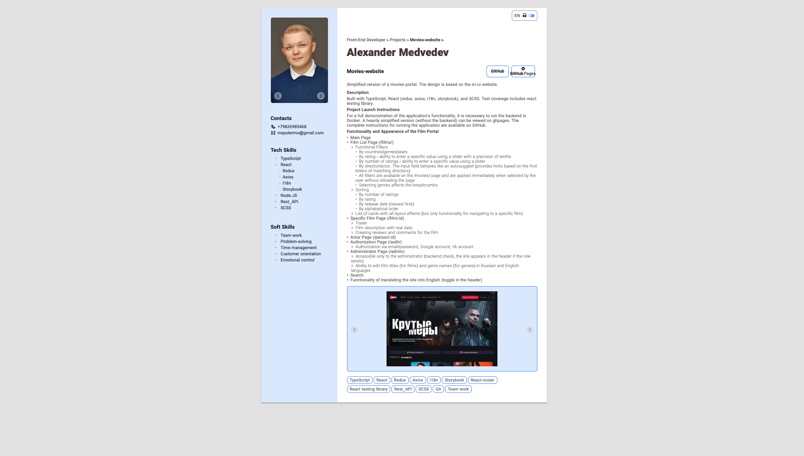
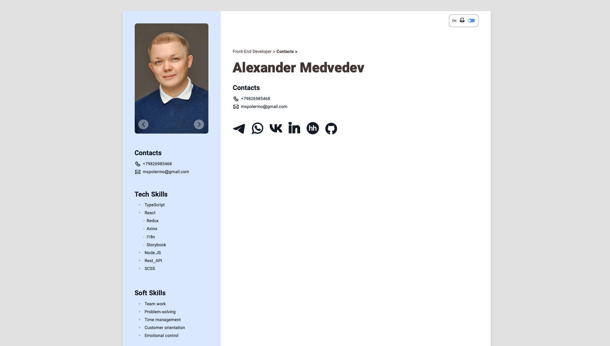

# 🪪 CV-frontend
Реализация интерактивного резюме

  
  
  
  
  
  

## 📃 Описание
Проект "CV-frontend" представляет собой интерактивное резюме, разработанное с использованием TypeScript и React, а также дополнительных библиотек, таких как Redux, Axios, i18n и React-router. Верстка выполнена с помощью SCSS.

## 🔖 Инструкция по запуску проекта
Для запуска проекта выполните следующие шаги:
- Склонируйте репозиторий на ваш ПК.
- Перейдите в терминале в корневую папку проекта и переключитесь на ветку "master" с помощью команды git checkout master.
- Запустите проект с помощью команды npm start в терминале в корне проекта.

## 🛠️ Функционал и внешний вид 
Проект "CV-frontend" обладает следующими функциями и особенностями:
- Главная страница
  - Содержит краткую информацию о проектах, опыте работы, образовании и о себе.
  - Предоставляет навигацию на страницы с полной информацией.
- Шапка портала
  - Включает блок панели управления с возможностью смены языка, функцией печати резюме на 1 страницу и реализацией смены цветового оформления.
  - Предоставляет хлебные крошки для навигации на предыдущие разделы сайта с поддержкой английского и русского языка.
- Меню сайта
  - Содержит слайдер с фотографиями.
  - Включает блок контактов с интерактивными кнопками. По клику на пункт "Контакты" открывается страница с контактной информацией.
  - Предоставляет блок навыков, при клике на заголовок которого открывается страница с полным списком навыков, а при клике на определенный навык - страница с ссылками на проекты и опыт работы, подтверждающие получение навыка.
  - Реализован адаптивный дизайн, позволяющий сворачивать и разворачивать меню при необходимости.
- Страница "Проекты"
  - Содержит краткое описание проектов, включающее название, информацию о проекте, навыки, полученные на проекте, и превью.
  - При клике на название проекта открывается страница проекта с полной информацией.
- Страница конкретного проекта
  - Предоставляет полную информацию о проекте.
  - Включает кнопки GitHub и GitHub Pages для просмотра репозитория и самого проекта, размещенного на GitHub Pages.
  - Содержит слайдер со скриншотами проекта и теги навыков, полученных на проекте.
    - По клику на тег навыка открывается страница с сылками на проекты\опыт работы, подтверждающие получение навыка
- Страница "Опыт работы"
  - Предоставляет краткое описание опыта работы, включая суммарное время работы в компании, описание и навыки, полученные на работе.
  - При клике на название должности открывается страница с полной информацией.
- Страница работы
  - Содержит полную информацию о рабочих обязанностях, включая суммарное время работы в компании и теги навыков, полученных на работе.
    - По клику на тег навыка открывается страница с сылками на проекты\опыт работы, подтверждающие получение навыка
- Страница "Образование"
  - Предоставляет информацию об образовании и пройденных курсах.
- Страница "Обо мне"
  - Включает информацию о себе.
- Страница "Контакты"
  - Страница с интерактивными кнопками для связи.
- Страница "Навыки"
  - Содержит список всех навыков, полученных на проектах.
  - При клике на конкретный навык открывается страница с ссылками на проекты и опыт работы, подтверждающие получение навыка.
## 📎 Дополнительная информация
- Проект реализован с поддержкой планшетной, мобильной и версии для одностраничной печати.
- Приложение поддерживает различные языки и предоставляет возможность выбора языка интерфейса.
- Все данные, необходимые для отображения резюме, получает из JSON-файла.
  
  
